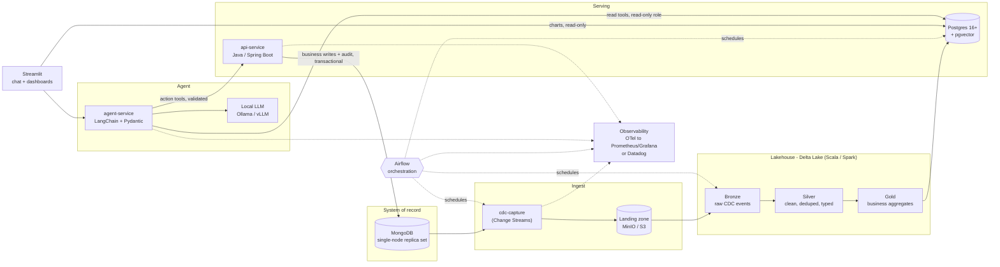

# ARCHITECTURE

> **Status:** Draft v0.2 · **Last updated:** 2026-09-21
> Read this before making structural changes. Decisions recorded here change through an ADR in `docs/adr/`, never silently in code.
> Companion docs: [`AGENTS.md`](AGENTS.md) (rules for AI coding agents: style, dependencies, git, hooks, CI) · [`docs/CICD_AND_GIT_HOOKS.md`](docs/CICD_AND_GIT_HOOKS.md) (CI/CD and local hooks in detail)

---

## 1. Purpose and scope

A production-style data platform plus an AI agent for a small transactional business (orders, users, accounts):

1. **Ingest** changes from MongoDB (the system of record) within minutes.
2. **Process** them through a bronze → silver → gold lakehouse with Scala/Spark on Delta Lake.
3. **Serve** curated data from Postgres (with pgvector) for fast queries and retrieval.
4. **Act:** an agent answers questions (read path) and performs business actions (write path) through a validated Java API.
5. **Observe:** pipeline freshness, data quality, service health, and agent behavior are monitored end to end.

### Scale assumptions

| Item | Assumption |
|---|---|
| Documents in MongoDB | < 1M (growth-ready, not growth-sized) |
| Freshness target | p95 end-to-end lag ≤ 5 minutes (Mongo write → visible in Postgres) |
| Users | Single tenant, tens of concurrent users |
| Availability | Best effort; no multi-region, no HA in v1 |

### Non-goals (v1)

- Sub-second streaming (Kafka/Flink). Near-real-time micro-batches are enough at this scale.
- Multi-tenancy, multi-region, or HA clustering.
- Letting the agent write to any datastore directly.

> **Honest note:** at this scale Postgres alone could do the job. The Spark/Delta layer exists so the system is built the way it would need to be as it grows, and to exercise Scala/Spark on purpose. Keep compute lightweight and do not add infrastructure the workload does not require.

---

## 2. Guiding principles

1. **Local-first.** Everything runs with `docker compose up` on a developer machine. Cloud is a deployment target, not a prerequisite.
2. **Portable Spark.** Scala jobs use only public Spark APIs (no RDDs, no internals), Scala 2.13, JDK 17, so the same JAR runs locally and on Databricks serverless.
3. **The agent has no write path to data stores.** It can only call validated API endpoints. The API is the safety boundary.
4. **Bronze is immutable; gold is rebuildable.** Any downstream layer can be regenerated from bronze.
5. **Idempotent everywhere.** Every job, load, and action can be retried without changing the result.
6. **Contracts at every boundary,** validated in code: Pydantic (Python), Bean Validation (Java), explicit Spark schemas (Scala).
7. **Observable by default.** A stage without metrics, structured logs, and a freshness signal is not finished.
8. **Vendor-neutral instrumentation.** Emit OpenTelemetry-compatible telemetry; the backend (Prometheus/Grafana or Datadog) is a deployment choice.
9. **One source of truth per concern.** Versions live in the parent POM, business rules live in the API, contracts live in OpenAPI.

---

## 3. System context



### The most important consequence of this design

Actions write to **MongoDB** (the system of record) via the API. Those changes flow back through CDC → lakehouse → Postgres, so Postgres is **eventually consistent** with a lag of up to ~5 minutes.

> **Read-after-write rule:** after an action, the agent and UI must report the result from the **API response**, never by re-querying Postgres. Tell the user that dashboards and summaries may take a few minutes to reflect the change.

---

## 4. Components

| Component | Tech | Responsibility | Owns |
|---|---|---|---|
| `mongo` | MongoDB 7+ as a single-node **replica set** (required for Change Streams and transactions) | System of record for orders, users, accounts | Business documents, action audit, idempotency keys |
| `cdc-capture` | Java 17, Mongo driver | Tails Change Streams, writes NDJSON batches to landing, persists resume tokens | `ops.cdc_offsets` (Postgres) |
| `minio` | MinIO (S3 API) locally; S3/ADLS/GCS in cloud | Landing zone, Delta table storage, Spark checkpoints | Files only |
| `spark-jobs` | Scala 2.13, Spark + Delta, Maven shaded JAR | Landing → bronze → silver → gold; DQ checks; Postgres load staging | Delta tables |
| `postgres` | Postgres 16+ with `pgvector` | Serving layer: gold tables, embeddings, ops metadata | `gold.*`, `serving.*`, `ops.*` |
| `api-service` | Java 17, Spring Boot | Validated business actions; enforces rules, authz, limits, idempotency | Writes to Mongo |
| `agent-service` | Python 3.12, LangChain, Pydantic | Q&A (read tools + RAG) and actions (API tools) | Nothing durable except traces |
| `llm` | Ollama (dev) / vLLM (GPU serving) | Local open-source model inference | Model weights |
| `dashboard` | Streamlit | Chat UI, human confirmation of risky actions, read-only charts | Nothing |
| `airflow` | Apache Airflow | Orchestrates ingest, transform, load, DQ gates, maintenance | DAG state |
| `monitoring` | OTel, Prometheus, Grafana, Langfuse; Datadog Agent (opt-in) | Metrics, traces, logs, alerts, LLM traces | Telemetry |

### Repository layout

```
.
├── AGENTS.md                  # rules for AI coding agents
├── ARCHITECTURE.md            # this file
├── pom.xml                    # parent POM: versions, BOMs, plugins, enforcer, Spotless
├── mvnw, .mvn/                # Maven wrapper (always use ./mvnw)
├── spark-jobs/                # Scala 2.13 jobs (shaded fat JAR, Spark/Delta = provided)
├── cdc-capture/               # Java: Change Streams -> landing zone
├── api-service/               # Java/Spring Boot: validated action endpoints
├── agent-service/             # Python: LangChain agent, Pydantic tool schemas
├── dashboard/                 # Streamlit app
├── airflow/                   # DAGs, plugins, tests
├── db/migrations/             # Flyway SQL migrations for Postgres
├── deploy/                    # databricks.yml bundle (later), VPS/Caddy config
├── monitoring/                # OTel collector, Prometheus, Grafana, alert rules, Datadog conf
├── scripts/                   # dev scripts + hooks (scripts/hooks/, incl. check_comments.py)
├── testdata/                  # synthetic fixtures only (never real customer data)
├── docs/                      # CICD_AND_GIT_HOOKS.md, adr/
├── docker-compose.yml         # profiles: core, pipeline, llm, obs-oss, obs-datadog
├── Makefile                   # canonical commands (see AGENTS.md)
├── .pre-commit-config.yaml
└── .github/                   # workflows, dependabot, CODEOWNERS, PR template
```

### Version matrix (pinned in the parent POM / `pyproject.toml`)

| Item | Target | Note |
|---|---|---|
| JDK | 17 | Must match the Databricks serverless environment if deploying there |
| Scala | 2.13.x | All Scala dependencies use the `_2.13` suffix |
| Spark / Delta | Match the Databricks serverless environment you will target | **TODO:** confirm exact versions in the Databricks docs before pinning |
| Python | 3.12 | Agent, dashboard, Airflow |
| Postgres | 16+ | With `pgvector` |
| MongoDB | 7+ | Replica set enabled |

---

## 5. Build and dependency management

Full rules for contributors and agents are in [`AGENTS.md`](AGENTS.md) section 5. The architectural contract is:

| Concern | Rule |
|---|---|
| Build tool | One Maven multi-module build for Java and Scala, run through the Maven wrapper |
| Versions | Declared only in the parent POM (`<properties>`, `<dependencyManagement>`, `<pluginManagement>`); child POMs carry no versions |
| Scala suffix | Always `_${scala.binary.version}`; the enforcer bans mixed Scala binary versions |
| Spark and Delta | `provided` scope, never bundled; versions equal the target runtime |
| Packaging | `spark-jobs` builds a shaded JAR with relocation of clashing libraries; Spring Boot modules use the Boot repackage goal |
| Guardrails | `maven-enforcer-plugin`: Java 17, dependency convergence, banned `_2.12`/`_3` artifacts, no SNAPSHOT or version ranges |
| Python | `uv` with a committed lockfile per service; CI installs with `--frozen` |
| Updates | Dependabot in grouped weekly PRs; JDK, Scala, Spark, Delta, and Spring Boot major upgrades only through an ADR and move together |

---

## 6. Data pipeline

### 6.1 Ingest (Mongo → landing)

- `cdc-capture` opens a Change Stream per collection with `fullDocument: updateLookup` so update events carry the full document.
- Events are batched (by count or time, whichever comes first) into NDJSON files under `landing/<collection>/dt=YYYY-MM-DD/`.
- The **resume token** is persisted to `ops.cdc_offsets` only **after** the batch file is durably written. On restart, capture resumes from the last token, so the pipeline is at-least-once and duplicates are removed downstream.
- If the oplog rolls past the stored token, the stream is invalid. Run the backfill DAG (full collection snapshot to landing) and reset the token.

### 6.2 Bronze (raw, immutable)

Append-only Delta table per collection. Store the raw payload as a JSON string so upstream schema changes never break ingestion.

| Column | Meaning |
|---|---|
| `event_id` | Deterministic hash of `(ns, documentKey, clusterTime, operationType)`; dedupe key |
| `collection`, `doc_id` | Source namespace and document key |
| `op` | `insert` / `update` / `replace` / `delete` |
| `cluster_time` | Mongo commit timestamp (event time) |
| `full_document` | Raw JSON string (null for deletes) |
| `source_file`, `ingested_at` | Lineage and processing time |

Bronze ingestion runs as an incremental batch (`Trigger.AvailableNow`-style semantics) with checkpoints in object storage, so it behaves the same locally and on Databricks serverless.

### 6.3 Silver (clean, deduped, typed)

- Parse `full_document` with an **explicit schema** (never `inferSchema`).
- Deduplicate by `(collection, doc_id)`, keeping the latest event by `cluster_time`; apply with `MERGE`.
- Deletes become soft deletes (`is_deleted = true`, `deleted_at`).
- Enforce types, non-null keys, and referential checks (for example orders reference existing users).
- Rows failing validation go to `silver_rejects` with a reason code. They are never dropped silently.

### 6.4 Data-quality gate

Between silver and gold, a gate evaluates expectations (null rates on key columns, duplicate keys, reject ratio, row-count sanity vs the previous run). If the gate fails, **gold and the Postgres load are skipped**, an alert fires, and serving data stays at the last good state.

### 6.5 Gold (business-level)

Rebuildable aggregates sized to what the app and agent actually query. Starting set (adjust to your real domain):

- `customer_summary`: lifetime value, order count, last order date, open issues
- `order_facts`: one row per order, denormalized for lookup
- `order_metrics_daily`: counts, revenue, refund rate by day

### 6.6 Load to Postgres

1. Spark writes each gold table to a **staging** table (`serving.<table>_stg`) over JDBC.
2. Airflow runs one SQL transaction per table: upsert into `gold.<table>` with `INSERT ... ON CONFLICT DO UPDATE`, then remove keys absent from the new snapshot when the table is a full snapshot.
3. The load records `ops.load_runs(table, run_id, rows, source_max_cluster_time, finished_at)`. The freshness metric comes from `source_max_cluster_time`.

### 6.7 Embeddings (RAG)

- Text worth retrieving (policies, product info, support notes) is chunked and embedded with a local embedding model served by Ollama.
- Stored in `serving.doc_chunks(embedding vector(N))` with an **HNSW** index. `N` is fixed by the embedding model; changing the model requires a re-embed migration.
- The refresh task only embeds new or changed chunks (content hash comparison).

### 6.8 Orchestration (Airflow)

| DAG | Schedule | Tasks |
|---|---|---|
| `pipeline_incremental` | every 3 min | `ingest_bronze` → `build_silver` → `dq_gate` → `build_gold` → `load_postgres` → `refresh_embeddings` (if changed) → `freshness_check` |
| `pipeline_backfill` | manual, parameterized | snapshot collection → landing → full rebuild of bronze onward |
| `maintenance` | nightly | Delta `OPTIMIZE`/`VACUUM`, landing retention, Postgres `VACUUM ANALYZE`, reject-table report |

Rules: tasks are idempotent, retried with backoff, and carry an SLA. The incremental DAG uses `max_active_runs=1` and `catchup=False` to avoid overlapping writers and backlog storms.

### 6.9 Freshness budget

The 5-minute target is a sum of stages, not just the DAG schedule. A 5-minute schedule alone would already consume the whole budget.

| Stage | Budget |
|---|---|
| CDC batch flush (count or time) | ≤ 30 s |
| Wait for the next DAG run | ≤ 180 s (3-minute schedule) |
| Pipeline run (bronze → Postgres) | ≤ 90 s |
| **Worst case end to end** | **≈ 300 s** |

If the run duration exceeds its budget, tighten the schedule, fold bronze → silver → gold into one Spark submit (each Spark task pays JVM startup), or relax the target. Decide from the measured `pipeline_end_to_end_lag_seconds`, not from guesses.

---

## 7. Serving layer (Postgres)

Schemas: `gold` (curated tables), `serving` (staging, embeddings), `agent_api` (views the agent may read), `ops` (offsets, load runs).

| Role | Access |
|---|---|
| `serving_writer` | Write to `gold`, `serving`; used by Spark/Airflow only |
| `agent_reader` | `SELECT` on `agent_api.*` views only; statement timeout and row limits enforced |
| `dashboard_reader` | `SELECT` on `gold.*` |
| `ops_rw` | Read/write `ops.*` |

Schema changes go through **Flyway** migrations in `db/migrations/`. Applied migrations are never edited.

---

## 8. API service (the action boundary)

Every state-changing capability of the agent goes through this Spring Boot service.

| Concern | Design |
|---|---|
| Endpoints | `POST /v1/orders`, `POST /v1/orders/{id}/refunds`, `PATCH /v1/accounts/{id}`, `POST /v1/actions/{token}/confirm` (examples) |
| Validation | Bean Validation on every request; unknown fields rejected; `422` on failure |
| Idempotency | Required `Idempotency-Key` header, unique index in Mongo; same key + same payload returns the original result; same key + different payload returns `409` |
| Business rules | Enforced **server-side** (refund ceilings, order state machine, account permissions) regardless of what the agent sends |
| Two-phase risk control | Actions above a risk threshold return `202` with a `confirmation_token`; a human confirms in the UI, then the action executes |
| Atomicity | Business write and audit record commit in one Mongo transaction |
| Audit | Every action records `actor` (user or agent), `trace_id`, input, outcome |
| Response | Returns the **resulting state** so callers never need to re-read Postgres |
| Contract | OpenAPI spec is the source of truth; Pydantic client models are **generated** from it |

Headers on all calls: `Idempotency-Key`, `X-Actor`, `X-Trace-Id`.

---

## 9. Agent service

### 9.1 Read path

- **Structured questions:** parameterized query tools over `agent_api` views (for example `get_customer_summary(customer_id)`, `list_orders(customer_id, status, since)`). SQL is templated in code, **not** generated by the model. Guarded text-to-SQL is a later, opt-in feature behind the read-only role.
- **Unstructured questions:** RAG over pgvector (`search_docs(query, k)`), with citations back to chunk ids.

### 9.2 Action path

- One tool per API operation, each with a strict Pydantic input model (`extra="forbid"`, typed fields, bounds).
- Tool input is validated before the HTTP call; API responses are validated on return.
- The agent generates the `Idempotency-Key` per user-approved intent and reuses it on retry.
- For a `202` response the agent tells the user confirmation is required and stops. It never calls the confirm endpoint itself.

### 9.3 Safety rules

1. No database credentials with write access exist in the agent's environment.
2. Retrieved text (documents, notes, customer-authored fields) is **untrusted**: it is never treated as instructions.
3. PII is minimized in prompts and never written to logs or traces beyond what is needed; redact at the tracing layer.
4. Max tool-call iterations and a per-request time budget are enforced.
5. If the LLM or API is down, the agent returns a clear degraded-mode message and takes no action.

### 9.4 Local LLM

- Hardware target: a GPU with **8 GB+ VRAM**, which fits a 4-bit quantized 7-8B-class instruction model with tool-calling support (for example a Llama or Qwen family model; benchmark candidates on your own tool-call test set before choosing).
- Ollama for development. vLLM if you need higher-throughput serving.
- **Docker note:** on Windows/Linux with an NVIDIA GPU, use the NVIDIA container toolkit and the `llm` compose profile. On macOS, Docker cannot use the Apple GPU, so run Ollama on the host and set `LLM_BASE_URL=http://host.docker.internal:11434`.
- Small models make more tool-call mistakes than hosted frontier models. That is why validation, server-side rules, and human confirmation are mandatory rather than optional.
- Keep an **evaluation set** (question → expected tool call and arguments) and run it whenever the model, prompt, or tool schemas change.

---

## 10. Observability

Instrument once with OpenTelemetry; choose the backend per environment.

| Profile | Stack | When |
|---|---|---|
| `obs-oss` (default, shipped in the public image) | OTel Collector → Prometheus + Grafana; Langfuse for LLM traces | Local dev, anyone pulling your images |
| `obs-datadog` (opt-in) | Datadog Agent container receiving OTel/StatsD/logs | Your own deployment or demo |

### Signals to emit

| Layer | Metrics and alerts |
|---|---|
| **Freshness (most important)** | `pipeline_end_to_end_lag_seconds` (now − `source_max_cluster_time`); alert when > target for 2 consecutive runs |
| **Pipeline** | Rows in/out per layer, reject count and ratio, duplicate count, job duration, DAG/task failures, SLA misses |
| **Data quality** | Null rates on key columns, gate pass/fail, schema drift events |
| **API** | Request rate, error rate, latency (p50/p95/p99), idempotency conflicts, confirmation-pending count, per action type |
| **Agent** | Tool-call counts and failures, Pydantic validation rejections, latency per step, token counts, refusal/degraded-mode rate |
| **Infrastructure** | Postgres (connections, slow queries, replication if any), Mongo oplog window, MinIO usage, container health, GPU memory |

### Conventions

- Structured JSON logs with `trace_id` propagated from UI → agent → API → Mongo audit record.
- Metric names: `snake_case`, unit suffix (`_seconds`, `_total`), labels are low-cardinality (never `customer_id`).
- **Datadog cost control:** the free tier is limited (roughly 5 hosts, 1-day retention, no APM/logs), and logs and custom metrics are billed separately. Keep label cardinality low, sample traces, and exclude noisy logs at the Agent. Verify current limits before relying on them.

---

## 11. Security

- **Secrets** only through environment variables or a secrets manager. Never in images, the repo, or logs. `.env.example` lists names only.
- **Least privilege** DB roles as in section 7. The agent role cannot write.
- **Network:** only `dashboard` (and `api-service` if exposed) are published. Data stores stay on the internal compose network.
- **AuthN/Z:** the dashboard authenticates users; the user identity travels as `X-Actor` and is checked by the API.
- **Supply chain:** Dependabot for updates, Trivy for image scanning, Gitleaks for secret scanning (local hook and CI), CI actions pinned by commit SHA. See `AGENTS.md` and the CI/CD doc.
- **Data:** synthetic fixtures only in the repo.

---

## 12. Testing strategy

| Layer | Approach |
|---|---|
| Spark jobs | ScalaTest with local Spark (`local[2]`), small synthetic fixtures; schema contract tests; idempotency test (run twice, same result) |
| `cdc-capture` | Testcontainers with a Mongo replica set; crash-and-resume test |
| API | Spring tests with Testcontainers Mongo; OpenAPI contract test; idempotency and business-rule tests |
| Agent | Unit tests on tool schemas; evaluation set against a fake or recorded LLM in CI; prompt-injection cases |
| Migrations | Flyway migrate on an empty pgvector container in CI |
| Airflow | DagBag import test, no cycles, retry and SLA settings present |
| Pipeline end to end | Compose smoke test: insert a Mongo document, assert it reaches Postgres within the freshness budget |

---

## 13. Deployment topologies

| Topology | Description | Status |
|---|---|---|
| **A. Local dev** | `docker compose --profile core --profile pipeline --profile obs-oss up`; Spark runs in the `spark-runner` container against MinIO | v1 |
| **B. Single VPS** | Same compose file behind a TLS reverse proxy (Caddy/Traefik), secrets from environment | v1.1 |
| **C. Databricks-backed** | Spark JAR deployed with a Databricks Asset Bundle; Delta on cloud object storage; Airflow triggers jobs | Later (requires a cloud account or Free Edition) |

Notes on topology C:

- Databricks **Free Edition** is serverless-only and restricts outbound internet access to a set of trusted domains, so it likely cannot reach a Mongo/Postgres running on your machine. Staging data through cloud storage would be required. Verify current limits, including whether JAR tasks are permitted on Free Edition, before committing to this path.
- Serverless JAR jobs require Scala/JDK versions matching the serverless environment and only public Spark APIs, which is why section 2 mandates them now.

### Compose profiles

| Profile | Services |
|---|---|
| `core` | mongo, postgres, minio, api-service, agent-service, dashboard |
| `pipeline` | airflow, spark-runner, cdc-capture |
| `llm` | ollama (GPU) |
| `obs-oss` | otel-collector, prometheus, grafana, langfuse |
| `obs-datadog` | datadog-agent |

All services define healthchecks; `docker compose up --wait` must succeed in CI (with a fake LLM, since CI has no GPU).

---

## 14. Failure modes

| Failure | Behavior | Recovery |
|---|---|---|
| `cdc-capture` crashes | No data loss; resumes from last token | Automatic restart; alert on lag |
| Oplog rolled past resume token | Change stream invalid | Run `pipeline_backfill`, reset token |
| Spark job fails mid-run | Delta commits are atomic; partial output not visible | Rerun (idempotent) |
| DQ gate fails | Gold and Postgres load skipped; serving stays on last good data | Fix source/logic; rerun; alert already fired |
| Postgres load partially fails | Per-table transaction rolls back | Rerun the load task |
| Duplicate CDC events | Deduped by `event_id` in bronze and by key in silver | None needed |
| Pipeline run exceeds its budget | Lag alert after 2 consecutive breaches | Tune schedule or job; see section 6.9 |
| Agent sends invalid tool args | Pydantic rejects before the API call | Model retries within iteration budget |
| Agent retries an action | Same `Idempotency-Key` returns the original result | None needed |
| LLM unavailable | Degraded-mode reply, no actions | Restart LLM service |
| API unavailable | Action tools disabled; reads still work | Restart API |

---

## 15. Key decisions (summary)

Full ADRs live in `docs/adr/`. Add one before changing any row below.

| # | Decision | Alternatives considered | Why |
|---|---|---|---|
| 1 | Near-real-time micro-batch (3-minute schedule, 5-minute p95 target) | Kafka/Flink streaming | Nothing needs sub-second freshness; far less operational cost |
| 2 | Delta Lake | Iceberg, Hive | Native to Databricks; Iceberg readable later via UniForm; Hive Metastore is legacy |
| 3 | Airflow | Databricks Workflows only | Pipeline spans Mongo, Spark, Postgres, embeddings, DQ, alerting |
| 4 | Maven multi-module with the Maven wrapper | sbt for Scala | One build and one version source for Java and Scala modules |
| 5 | Postgres + pgvector as serving/vector store | Separate vector DB | One fewer moving part at this scale |
| 6 | Agent writes only via API | Direct DB writes from LangChain | Safety boundary; business rules live in one place |
| 7 | Parameterized query tools | Free-form text-to-SQL | Predictability and safety with a small local model |
| 8 | Local-first, portable Spark | Databricks-only | No cloud account yet; same JAR later |
| 9 | OTel instrumentation; OSS stack default, Datadog opt-in | Datadog only | Public image must run without a vendor key; Datadog cost model |
| 10 | Two-phase confirmation for risky actions | Full autonomy | Small local models are less reliable; money-moving actions need a human |
| 11 | `uv` with lockfiles for Python | pip + requirements.txt | Reproducible installs, fast CI |

---

## 16. Open questions

- Exact gold tables and agent query tools (depends on your real collections).
- Which local model meets tool-call accuracy on your 8 GB+ VRAM GPU (needs the evaluation set).
- Exact Spark and Delta versions to pin (depends on the Databricks serverless environment).
- Which cloud, if any, for topology C, and whether Free Edition is sufficient.
- Authentication mechanism for the dashboard (basic, OIDC, or none for local-only use).
- Whether per-task Spark startup fits the freshness budget or the pipeline should run as one submit.
