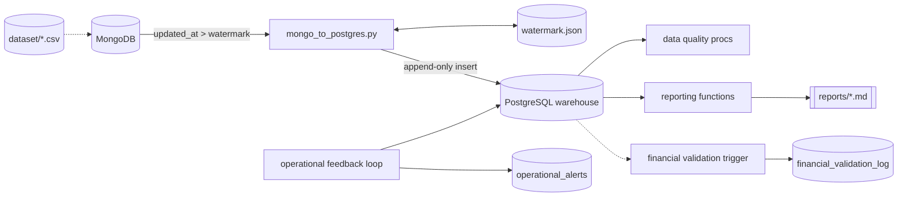

# LRDB --> Trucking & Logistics Data Platform

LRDB is a batch-oriented analytics platform built around a trucking and logistics operation. It takes a set of flat source files, stages them in MongoDB, syncs them incrementally into a PostgreSQL warehouse, and then layers data quality checks, parameterized reporting functions, financial validation, and operational alerting on top of that warehouse.

This README covers the whole repository at a glance. For the full system design, see `docs/architecture.md`. For how the tables relate to each other, see `docs/datacatlog.md`.

## What This Project Does

The platform models a typical trucking operation end to end: customers book loads, loads are carried over routes, trips execute those loads with a driver, truck, and trailer, and a handful of supporting tables record what actually happened — delivery events, fuel purchases, maintenance, and safety incidents. Two rollup tables summarize driver and truck performance month by month, and three monitoring tables (`kpi_thresholds`, `operational_alerts`, `financial_validation_log`) watch over the data and flag problems.

Everything downstream of the warehouse — data quality, reporting, alerting — only reads from PostgreSQL. Nothing writes back upstream to MongoDB, and MongoDB never writes back to the source CSVs.

## Repository Layout

```
LRDB
├─ assets/              PNGs referenced by reports/*.md
├─ dataset/             14 source CSVs (13 entities + 2 monthly rollups)
├─ docs/
│  ├─ architecture.md   full system design and data flow
│  └─ datacatlog.md     table relationships and entity-relationship diagram
├─ reports/
│  ├─ customer_report.md
│  ├─ driver_report.md
│  └─ truck_report.md
├─ scripts/
│  ├─ mongo_to_postgres.py   incremental Mongo -> Postgres ETL
│  └─ README.md
├─ sql/                 14 numbered scripts: reset, EDA, reporting, QA, ops
├─ tests/               6 data-quality stored procedures, one per core table
├─ utils/
│  ├─ connection.py     loads and validates DB credentials from .env
│  ├─ engine.py         builds the Postgres engine and Mongo client
│  ├─ logger.py         stage-aware logger factory
│  └─ README.md
├─ main.py              orchestration entry point
├─ watermark.json       ETL progress checkpoint, auto-generated
├─ pyproject.toml / uv.lock / .python-version
└─ LICENSE
```

## Architecture at a Glance



The dotted line into MongoDB marks a real gap: nothing in this repository documents how the source CSVs actually get loaded into MongoDB in the first place. See the limitations section below.

The warehouse itself has no declared foreign keys anywhere except primary keys on the three monitoring tables. Every relationship between tables is inferred from matching `*_id` column names rather than enforced by PostgreSQL. The central chain is:

```
customers ──┐
            ├──▶ loads ──▶ trips ──▶ (drivers + trucks + trailers)
routes ─────┘                │
                              ├──▶ delivery_events  (+ facilities)
                              ├──▶ fuel_purchases    (+ trucks, drivers)
                              └──▶ safety_incidents  (+ trucks, drivers)

maintenance_records ──▶ trucks
```

Full table-by-table mapping and the entity-relationship diagram are in `docs/datacatlog.md`.

## Getting Started

### 1. Environment

The Python environment is managed with `uv` (`pyproject.toml`, `uv.lock`, `.python-version`). Create a `.env` file at the project root:

```env
POSTGRES_HOST=localhost
POSTGRES_PORT=5432
POSTGRES_DATABASE=your_db
POSTGRES_USERNAME=your_user
POSTGRES_PASSWORD=your_password

MONGO_URI=mongodb://localhost:XXXXX
MONGO_DB=your_mongo_db
```

`utils/connection.py` validates all seven variables are present the moment it is imported, so a missing credential fails immediately at startup rather than partway through a run.

### 2. Run the ETL

```bash
python scripts/mongo_to_postgres.py                                  # full incremental sync, all collections
python scripts/mongo_to_postgres.py --collection trucks               # one collection only
python scripts/mongo_to_postgres.py --collection trucks --table trucks_raw
python scripts/mongo_to_postgres.py --full-refresh                    # drops and reloads everything, ignores watermark
```

This pulls each MongoDB collection in batches of 25,000 documents, keeping only documents newer than the saved watermark, casts columns into PostgreSQL types, and appends them into the matching table. See `docs/incremental.md` for a full walkthrough of how the watermark logic, type mapping, and table creation work underneath.

### 3. Build the warehouse and run the SQL layers

The `sql/` directory is numbered for sequential execution:

| Range | Purpose |
|---|---|
| `01`–`03` | Drop-all-tables reset and schema/row-count inspection |
| `04`–`05` | Exploratory analysis: fuel spend and fleet composition |
| `06`–`11` | Parameterized reporting functions (customers, drivers, trucks, routes, sales, facilities) |
| `12`–`13` | Metrics reconciliation and the financial validation trigger |
| `14` | Operational feedback loop and alerting |

### 4. Run the data quality procedures

```sql
CALL proc_customer_data_quality();
CALL proc_driver_data_quality();
CALL proc_delivery_events_data_quality();
CALL proc_loads_data_quality();
CALL proc_routes_data_quality();
CALL proc_trucks_data_quality();
```

Each procedure checks its table for nulls, duplicates, invalid formats, out-of-range values, and cross-field inconsistencies. A clean table raises a `NOTICE` and passes silently; a problem raises an `EXCEPTION` listing every failed check with its record count. Some checks are deliberately `NOTICE`-only warnings rather than hard failures, where the underlying business rule has not yet been confirmed against real data — for example, the years-of-experience-versus-age check on drivers.

## Components

**`dataset/`** — fourteen source CSVs: six core entities (`customers`, `drivers`, `trucks`, `trailers`, `routes`, `facilities`), six operational/event tables (`loads`, `trips`, `delivery_events`, `fuel_purchases`, `maintenance_records`, `safety_incidents`), and two monthly rollups (`driver_monthly_metrics`, `truck_utilization_metrics`).

**`scripts/`** — the Mongo-to-Postgres ETL described above, plus its own README.

**`utils/`** — shared infrastructure used by every Python script in the project: `connection.py` for credentials, `engine.py` for the actual SQLAlchemy/PyMongo connection objects (pooled, with `pool_pre_ping=True`), and `logger.py` for stage-aware logging (`extraction`, `transformation`, or `loading`), writing timestamped logs under `logs/<stage>/`.

**`sql/`** — fourteen numbered scripts covering reset/inspection, exploratory analysis, the reporting-function API, financial validation (via a `dblink`-based autonomous transaction so rejected records are still logged even when the main transaction rolls back), and the operational alerting loop.

**`tests/`** — six data-quality stored procedures, one per core table, each independently callable.

**`reports/`** — markdown reports generated from the `sql/06`–`08` reporting functions, illustrated with PNGs from `assets/`. `customer_report.md` covers portfolio revenue, segmentation, and delivery performance across 200 customers. `truck_report.md` covers fleet revenue, fuel efficiency by make, and maintenance cost concentration across 120 trucks. `driver_report.md` follows the same pattern for drivers.

**`docs/`** — `architecture.md` for the full system design and data flow, and `datacatlog.md` for the table relationship map and entity-relationship diagram.

## Known Limitations

- **No foreign key enforcement.** Every join across the data quality, reporting, and alerting layers depends on `*_id` naming conventions rather than database-enforced relationships. An orphaned row will not raise a database error anywhere in this stack.
- **The ETL is append-only, not upsert.** A new watermark only guarantees nothing is missed, not that updated records replace old ones. Any table holding mutable records will accumulate duplicate `*_id` rows over time unless something downstream collapses them.
- **Type mapping in the ETL is hand-maintained.** New numeric or integer fields added on the MongoDB side need a matching entry in `BIGINT_COLS` or `NUMERIC_COLS` inside `extract_schema_and_flatten()`, or they fall through to `VARCHAR`.
- **`updated_at` is a hard dependency for incremental sync.** Any collection missing this field is always fully re-pulled.
- **`--full-refresh` is destructive.** It runs `DROP TABLE IF EXISTS` with no backup step built in.
- **The CSV-to-MongoDB loading step is undocumented.** Nothing in this repository describes how `dataset/*.csv` gets into MongoDB in the first place.
- **Report-generation mechanics are unconfirmed.** `main.py` is the likely orchestrator for `reports/*.md` and `assets/*.png`, but the exact build process is not detailed anywhere yet.
- **Some data-quality rules are unvalidated warnings**, pending confirmation against more data before being promoted to hard failures.

## License

See `LICENSE`.
