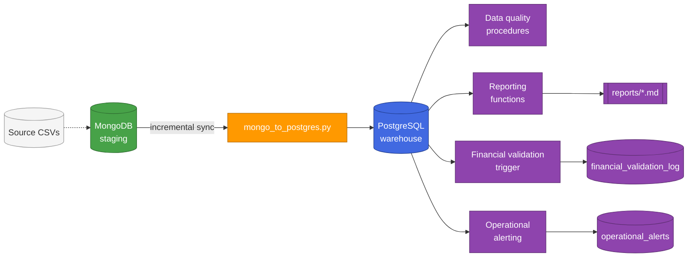

<p align="center">
  
</p>

<h1 align="center">LRDB — Trucking & Logistics Data Platform</h1>

<p align="center">
  
  
  
  
  
</p>

A batch analytics platform for a trucking and logistics operation. Source CSVs are staged in MongoDB, synced incrementally into a PostgreSQL warehouse, then layered with data quality checks, parameterized reporting functions, financial validation, and operational alerting — covering customers, loads, trips, drivers, trucks, trailers, and the delivery/fuel/maintenance/safety events around them.

## Architecture


```mermaid
flowchart LR
    CSV[("Source CSVs")] -.-> MONGO[("MongoDB<br/>staging")]
    MONGO -- "incremental sync" --> ETL["mongo_to_postgres.py"]
    ETL --> PG[("PostgreSQL<br/>warehouse")]
    PG --> DQ["Data quality<br/>procedures"]
    PG --> RPT["Reporting<br/>functions"] --> DOCS[["reports/*.md"]]
    PG --> TRG["Financial validation<br/>trigger"] --> FVL[("financial_validation_log")]
    PG --> ALERT["Operational<br/>alerting"] --> OPS[("operational_alerts")]

    classDef source fill:#f5f5f5,stroke:#999,color:#333;
    classDef stage fill:#47A248,stroke:#2e6b30,color:#fff;
    classDef etl fill:#FF9900,stroke:#b36b00,color:#fff;
    classDef warehouse fill:#4169E1,stroke:#1e3a8a,color:#fff;
    classDef output fill:#8e44ad,stroke:#5b2c6f,color:#fff;

    class CSV source;
    class MONGO stage;
    class ETL etl;
    class PG warehouse;
    class DQ,RPT,TRG,ALERT,DOCS,FVL,OPS output;
```

Everything downstream of the warehouse — data quality, reporting, alerting — only reads from PostgreSQL; nothing writes back upstream. Table-by-table relationships are in `docs/datacatlog.md`.

## Docs

| Doc | Covers |
|---|---|
| [`docs/architecture.md`](docs/architecture.md) | Full system design and data flow |
| [`docs/datacatlog.md`](docs/datacatlog.md) | Table relationships and ER diagram |
| [`docs/incremental.md`](docs/incremental.md) | Watermark logic and type mapping |
| [`scripts/README.md`](scripts/README.md) | ETL script details |
| [`utils/README.md`](utils/README.md) | Shared connection/logging infra |

## Connect

```bash
git clone https://github.com/Nitinx12/Logistic-Relational-Database
cd LRDB
uv sync
```

Add a `.env` at the project root (Postgres + Mongo credentials see `utils/connection.py` for the exact variable names), then:

```bash
uv run python scripts/mongo_to_postgres.py              # sync Mongo -> Postgres
psql "$DATABASE_URL" -f sql/01_lp_drop_all_tables.sql   # ...through sql/14, in order
```

Full setup, the SQL execution order, and data-quality procedures are detailed in the docs above.

## License

See `LICENSE`.