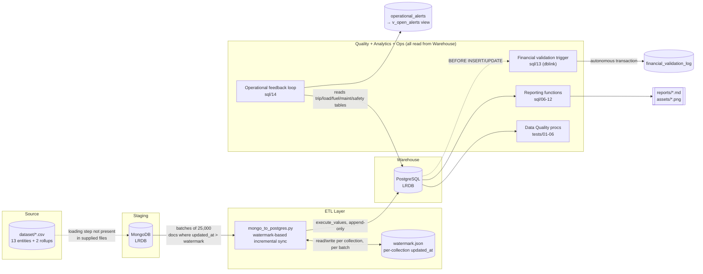

# LRDB — System Architecture

## Scope

This document covers the **data platform** half of LRDB: the source datasets, the MongoDB→PostgreSQL ETL pipeline, the PostgreSQL data warehouse, and the SQL-based data quality / analytics / monitoring layers built on top of it. It is assembled from `docs/datacatlog.md`, the five component `README.md` files (`scripts/`, `sql/`, `tests/`, `utils/`, project root), and `watermark.json`.

It does **not** cover the Go REST API (Gin + PostgreSQL) that serves this warehouse to external consumers — that's a separate service sitting on top of the same `LRDB` Postgres database and isn't part of the files this document is based on.

---

## 1. System Overview

LRDB is a batch-oriented analytics platform for a trucking/logistics operation. Data flows in one direction — from flat files, through a document store, into a relational warehouse — and then fans out into three independent SQL-driven layers that all read from the same warehouse tables:

| Layer | Responsibility |
|---|---|
| **Staging** | MongoDB holds the working copy of each entity collection (source for the ETL) |
| **ETL** | `mongo_to_postgres.py` incrementally syncs Mongo collections into Postgres tables |
| **Warehouse** | PostgreSQL (`LRDB` database) — 13 entity/operational tables + 2 monthly rollups + 3 monitoring tables |
| **Data Quality** | Six `CALL`-able procedures, one per core table, that audit the warehouse after each load |
| **Analytics** | Parameterized PL/pgSQL reporting functions that back the report files in `reports/` |
| **Integrity & Ops** | A financial-validation trigger and an operational alerting loop that run continuously against the warehouse |

No layer talks back upstream — Mongo doesn't know about Postgres, and Postgres doesn't write back to Mongo. Everything downstream of the warehouse (data quality, analytics, alerting) is pure read-and-report against Postgres.

---

## 2. High-Level Data Flow



The dotted arrow into MongoDB is a known documentation gap, not an assumption about what exists — see [§7](#7-known-limitations--open-gaps).

---

## 3. Repository Layout

```
LRDB
├─ dataset/            # 14 source CSVs (13 entities + 2 monthly rollups)
├─ assets/              # PNGs referenced by reports/*.md
├─ docs/                # datacatlog.md, architecture.md (this file)
├─ reports/             # customer_report.md, driver_report.md, truck_report.md
├─ scripts/
│  ├─ mongo_to_postgres.py
│  └─ README.md
├─ sql/                 # 14 numbered scripts, utility → EDA → reporting → QA → ops
├─ tests/               # 6 data-quality stored procedures
├─ utils/               # connection.py, engine.py, logger.py — shared infra
├─ main.py              # orchestration entry point (not in supplied files)
├─ watermark.json        # ETL progress checkpoint, auto-generated
└─ uv.lock / pyproject.toml / .python-version   # uv-managed Python env
```

---

## 4. Component Details

### 4.1 Source data — `dataset/`

Fourteen CSVs: the six **core entities** (`customers`, `drivers`, `trucks`, `trailers`, `routes`, `facilities`), the six **operational/event tables** (`loads`, `trips`, `delivery_events`, `fuel_purchases`, `maintenance_records`, `safety_incidents`), and the two **monthly rollups** (`driver_monthly_metrics`, `truck_utilization_metrics`). These are the eventual Postgres table names too — naming is consistent end-to-end. How these CSVs get into MongoDB isn't covered by any of the supplied files (see §7).

### 4.2 Staging — MongoDB

Acts purely as the ETL's read source. The pipeline expects every document to carry an `updated_at` field; collections without one are always fully re-pulled, since there's no way to filter incrementally.

### 4.3 Shared infrastructure — `utils/`

Three modules used by every other Python script in the project:

- **`connection.py`** — loads `POSTGRES_HOST/PORT/DATABASE/USERNAME/PASSWORD` and `MONGO_URI/MONGO_DB` from `.env` via `python-dotenv`, and validates all of them are present at import time (`EnvironmentError` if not — fail fast, not mid-run). Also exposes `get_mongo_db()`.
- **`engine.py`** — builds the actual connection objects: `postgres_engine()` returns a SQLAlchemy engine over `psycopg2` with connection pooling (`pool_size=5`, `max_overflow=10`, `pool_pre_ping=True`); `mongo_client()` returns a connected PyMongo database object.
- **`logger.py`** — `get_logger(stage, name)` factory. `stage` is restricted to `extraction` / `transformation` / `loading`; each call writes to `logs/<stage>/<name>_<timestamp>.log` (console at `INFO`, file at `DEBUG`), and is idempotent against duplicate handler registration.

This module is the only place credentials are read from disk — everything else in the project consumes them through `connection.py`/`engine.py`.

### 4.4 ETL — `scripts/mongo_to_postgres.py`

The sync mechanism end to end:

1. Connect to Mongo (`MONGO_URI`/`MONGO_DB`).
2. For each collection, check `watermark.json` for the last synced `updated_at`. No entry → pull everything.
3. Query Mongo for `updated_at > watermark`, sorted ascending, in batches of **25,000** docs.
4. Flatten each batch with pandas: drop `_id`, sanitize column names for Postgres, and type-cast using **hardcoded** rules — `BIGINT_COLS` / `NUMERIC_COLS` sets, date/timestamp field-name conventions, with everything else defaulting to `VARCHAR` (or `JSONB` for dicts/lists).
5. Ensure the target table exists — create on first run, `ALTER TABLE` to add any new columns on later runs; `--full-refresh` instead does `DROP TABLE IF EXISTS` then recreates.
6. Bulk-insert the batch via `execute_values`. **No upsert** — this is strictly append-only.
7. Persist the watermark after each batch (not just at the end), so a mid-run crash doesn't force a full re-pull.
8. Repeat per collection — either every collection in `ALL_COLLECTIONS`, or just one via `--collection`, optionally into a renamed table via `--table`.

```bash
python mongo_to_postgres.py                                   # full incremental sync
python mongo_to_postgres.py --collection trucks                # single collection
python mongo_to_postgres.py --collection trucks --table trucks_raw
python mongo_to_postgres.py --full-refresh                     # destructive, ignores watermark
```

`watermark.json` is the durable state for this whole layer — one ISO-8601 UTC timestamp per collection, all currently sitting at `2026-06-16T06:22:06.809Z` per the uploaded snapshot, meaning every collection was last fully caught-up as of that run.

### 4.5 Warehouse — PostgreSQL (`LRDB` database)

No `FOREIGN KEY` constraints exist anywhere in the schema — `PRIMARY KEY` is only declared on the three monitoring/audit tables. Every relationship below is inferred from `*_id` naming, not enforced by the database.

**Core entities** (referenced by everything, reference nothing): `customers`, `drivers`, `trucks`, `trailers`, `routes`, `facilities`.

**Operational chain:**

```
customers ──┐
            ├──▶ loads ──▶ trips ──▶ (drivers + trucks + trailers)
routes ─────┘                │
                              ├──▶ delivery_events  (+ facilities)
                              ├──▶ fuel_purchases    (+ trucks, drivers)
                              └──▶ safety_incidents  (+ trucks, drivers)

maintenance_records ──▶ trucks   (standalone off the truck entity, not the trip chain)
```

**Monthly rollups:** `driver_monthly_metrics` (per `driver_id` + `month`), `truck_utilization_metrics` (per `truck_id` + `month`) — pre-aggregated summaries of the operational tables above.

**Monitoring/governance tables** are the odd ones out — they reference *other tables generically* rather than via a fixed FK column:

- **`kpi_thresholds`** — standalone config: `warning_threshold` / `critical_threshold` per `kpi_name`, matched by name rather than key.
- **`operational_alerts`** — polymorphic via `entity_type` + `entity_id`, pointing at a row in whichever table triggered the alert.
- **`financial_validation_log`** — polymorphic audit log via `table_name` + `record_id`, identifying which row in which table failed a financial check.

Full table-by-table relationship map and the Mermaid ER diagram live in `docs/datacatlog.md`.

### 4.6 Data Quality — `tests/`

Six PL/pgSQL procedures, one per table, each callable directly:

| Procedure | Table |
|---|---|
| `proc_customer_data_quality()` | `customers` |
| `proc_driver_data_quality()` | `drivers` |
| `proc_delivery_events_data_quality()` | `delivery_events` |
| `proc_loads_data_quality()` | `loads` |
| `proc_routes_data_quality()` | `routes` |
| `proc_trucks_data_quality()` | `trucks` |

Each checks nulls, duplicates, invalid formats, out-of-range values, and cross-field inconsistencies, then either `RAISE NOTICE`s clean or `RAISE EXCEPTION`s with every failed check and its record count. A subset of checks are deliberately `NOTICE`-only warnings rather than hard failures, because the underlying business rule hasn't been confirmed against real data yet — e.g. the years-of-experience-vs-age check on drivers, or excessive-weight on loads. Every enum/allowed-value list *was* confirmed against actual data (it's the warning-tier checks that are the unconfirmed ones). Promoting a warning to a hard failure is a one-line change: move its `RAISE NOTICE` into the procedure's `v_errors` accumulator.

### 4.7 Analytics — `sql/`

Fourteen numbered scripts, meant to run in order, grouped into five tiers:

1. **Utility & inspection** (`01`–`03`) — drop-all-tables reset block, an `information_schema`-driven data dictionary, and a `UNION ALL` row-count/volume report across all major tables.
2. **EDA** (`04`–`05`) — fuel spend aggregation (by state, by driver, cost/gallon) and fleet composition analysis (status, make/model, fuel type, tank capacity vs. age).
3. **Parameterized reporting functions** (`06`–`11`) — a PL/pgSQL "reporting API": customer performance, driver stats (revenue + MPG + idle hours + safety history), truck fleet economics (miles, MPG, revenue/mile, cost/mile), route/lane performance, dynamic-time-bucket sales aggregation (`10`, via `EXECUTE format(...)`), and facility dock/detention normalization.
4. **Data quality & financial validation** (`12`–`13`) — `12` reconciles dynamically-computed monthly metrics against the pre-aggregated rollup tables to catch drift; `13` is the financial-validation trigger (detailed in §5.4).
5. **Automated operational feedback** (`14`) — the alerting loop (detailed in §5.5).

Recurring patterns across this layer: CTEs pre-aggregate one-to-many relationships *before* joining to the master entity list, specifically to avoid join fan-out; `COUNT(...) FILTER (WHERE ...)` is used heavily for conditional aggregation without subqueries; and the time-bucketed sales report uses dynamic SQL to reshape its output schema based on a granularity parameter.

### 4.8 Reporting outputs — `reports/`, `assets/`

`customer_report.md`, `driver_report.md`, `truck_report.md`, each presumably backed by the corresponding `sql/06`–`08` function and illustrated with the matching PNGs in `assets/customer_report/`, `assets/driver_report/`, `assets/trucks_report/` (top-10 revenue, MPG by make, fleet status breakdown, cost-per-mile distribution, etc.). The generation step itself (`main.py`?) isn't among the supplied files, so the exact report-build mechanics aren't confirmed here.

---

## 5. Cross-Cutting Concerns

### 5.1 Referential integrity is convention, not enforcement

Since there are no `FOREIGN KEY`s, every join in every report/QA/alerting script is only as correct as the `*_id` naming convention. Orphaned rows (e.g. a `trip` whose `driver_id` no longer matches any `drivers` row) won't raise a database error anywhere in this stack — they'd only surface through the data-quality procedures or the reconciliation report, if at all.

### 5.2 Incremental loading is append-only, not upsert

The watermark pattern guarantees nothing is *missed*, but guarantees nothing about *replacement*. If a Mongo doc is updated and its `updated_at` advances, the next sync inserts a **new row** in Postgres rather than replacing the old one. This is fine for naturally event-style collections (e.g. `delivery_events`, `fuel_purchases`) but means any table holding mutable records (e.g. a `customers` profile edit, a `trucks` status change) will accumulate duplicate `*_id` rows over time unless something downstream — a dedup view, a `dbt` model — collapses them back to one row per ID. Nothing in the supplied files currently does that collapsing.

### 5.3 Warning-tier vs. hard-failure data quality checks

The data-quality layer deliberately separates "this is definitely wrong" (hard `EXCEPTION`) from "this looks wrong but we haven't confirmed the rule" (`NOTICE`-only warning). This keeps the procedures from blocking a load on a guess, at the cost of needing someone to periodically revisit the warning list and decide which ones are safe to promote.

### 5.4 Financial validation via autonomous transactions

`13_trg_financial_validation.sql`'s `BEFORE INSERT/UPDATE` triggers reject records with invalid financials (negative revenue, mismatched maintenance cost, etc.) before they ever land. The interesting part: rejected attempts still need to be logged for audit purposes, but a rolled-back transaction would normally roll back that log entry too. The trigger uses the `dblink` extension to open a separate connection and commit the audit row to `financial_validation_log` **independently** of the main transaction's outcome — a true autonomous transaction, which Postgres doesn't support natively without an extension like this.

### 5.5 Operational feedback loop

`14_lp_operational_feedback.sql` defines per-KPI `warning_threshold`/`critical_threshold` pairs in `kpi_thresholds`, then a master `run_feedback_loop` procedure that calls individual domain checks (Driver, Fleet, Safety, Delivery, Fuel, Maintenance) and writes any threshold breach into `operational_alerts` — using the polymorphic `entity_type`/`entity_id` pair described in §4.5, since a single alerts table has to represent breaches from six unrelated domains. `v_open_alerts` is the surfacing view on top of that table.

---

## 6. Configuration & Environment

Python environment is `uv`-managed (`pyproject.toml`, `uv.lock`, `.python-version`). Required `.env` variables, validated at import time by `utils/connection.py`:

```
POSTGRES_HOST, POSTGRES_PORT, POSTGRES_DATABASE, POSTGRES_USERNAME, POSTGRES_PASSWORD
MONGO_URI, MONGO_DB
```

The supplied `.env` snapshot also defines `PYSPARK_PYTHON` / `PYSPARK_DRIVER_PYTHON`, pointing at a `.venv` interpreter — but `mongo_to_postgres.py` as documented is a pandas pipeline, not a Spark one. Either there's a PySpark-based step elsewhere in the project not covered by the supplied files, or this is leftover config from the pattern shared with the Museum project's PySpark ETL. Worth confirming which.

---

## 7. Known Limitations & Open Gaps

- **No FK enforcement** — all relationships are inferred from column naming (§5.1).
- **Append-only ETL on mutable data** — duplicate rows accumulate for any collection where docs get updated in place (§5.2).
- **Hardcoded type mapping** — new numeric/bigint fields added on the Mongo side need a matching entry in `BIGINT_COLS`/`NUMERIC_COLS` in `extract_schema_and_flatten()`, or they'll fall through to `VARCHAR`.
- **`updated_at` is a hard dependency** for incremental sync — any collection missing it always does a full pull.
- **`--full-refresh` is destructive** (`DROP TABLE IF EXISTS`) — no backup step is built in.
- **CSV → MongoDB loading step is undocumented** — none of the supplied files describe how `dataset/*.csv` gets into MongoDB in the first place; the diagram in §2 marks this as an open gap rather than assuming a script that wasn't provided.
- **Report-generation mechanics are unconfirmed** — `main.py` (the likely orchestrator for `reports/*.md` + `assets/*.png`) wasn't among the supplied files.
- **Some data-quality rules are unvalidated warnings**, pending confirmation against more data (§5.3).