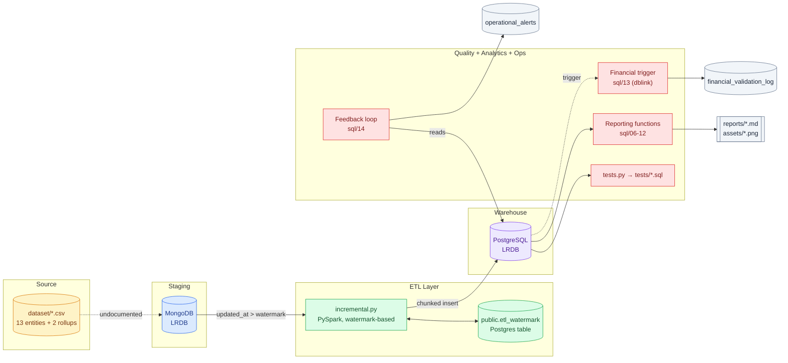

# LRDB — System Architecture

## Scope

Covers the data platform half of LRDB: source datasets, the MongoDB → PostgreSQL ETL pipeline, the PostgreSQL warehouse, and the SQL-based data quality, analytics, and monitoring layers on top of it.

Does **not** cover the Go REST API (Gin + PostgreSQL) that serves this warehouse externally — a separate service on the same `LRDB` database.

---

## 1. System Overview

LRDB is a batch-oriented analytics platform for a trucking/logistics operation. Data flows one way — flat files → document store → relational warehouse — then fans out into three independent SQL layers, all reading from the same warehouse tables:

| Layer | Responsibility |
|---|---|
| **Staging** | MongoDB holds the working copy of each entity collection |
| **ETL** | `scripts/incremental.py` — PySpark incremental sync, Mongo → Postgres |
| **Warehouse** | PostgreSQL (`LRDB`) — 13 entity/operational tables, 2 monthly rollups, 3 monitoring tables |
| **Data Quality** | `scripts/tests.py` runs the PL/pgSQL audit procedures in `tests/` |
| **Analytics** | Parameterized PL/pgSQL reporting functions backing `reports/` |
| **Integrity & Ops** | A financial-validation trigger and an alerting loop, running continuously |

Nothing flows back upstream — Mongo doesn't know about Postgres, and Postgres never writes to Mongo. Everything past the warehouse is read-and-report only.

---

## 2. High-Level Data Flow


```mermaid
flowchart LR
    subgraph Source
        CSV[("dataset/*.csv<br/>13 entities + 2 rollups")]
    end

    subgraph Staging
        MONGO[("MongoDB<br/>LRDB")]
    end

    subgraph "ETL Layer"
        ETL["incremental.py<br/>PySpark, watermark-based"]
        WM[("public.etl_watermark<br/>Postgres table")]
    end

    subgraph Warehouse
        PG[("PostgreSQL<br/>LRDB")]
    end

    subgraph "Quality + Analytics + Ops"
        DQ["tests.py → tests/*.sql"]
        ANALYTICS["Reporting functions<br/>sql/06-12"]
        TRIGGER["Financial trigger<br/>sql/13 (dblink)"]
        FEEDBACK["Feedback loop<br/>sql/14"]
    end

    REPORTS[["reports/*.md<br/>assets/*.png"]]
    FVL[("financial_validation_log")]
    ALERTS[("operational_alerts")]

    CSV -. "undocumented" .-> MONGO
    MONGO -- "updated_at > watermark" --> ETL
    ETL <--> WM
    ETL -- "chunked insert" --> PG
    PG --> DQ
    PG --> ANALYTICS --> REPORTS
    PG -. trigger .-> TRIGGER --> FVL
    FEEDBACK -- reads --> PG
    FEEDBACK --> ALERTS

    classDef source fill:#fef3c7,stroke:#d97706,color:#78350f
    classDef staging fill:#dbeafe,stroke:#2563eb,color:#1e3a8a
    classDef etl fill:#dcfce7,stroke:#16a34a,color:#14532d
    classDef warehouse fill:#ede9fe,stroke:#7c3aed,color:#4c1d95
    classDef ops fill:#fee2e2,stroke:#dc2626,color:#7f1d1d
    classDef output fill:#f1f5f9,stroke:#64748b,color:#1e293b
    class CSV source
    class MONGO staging
    class ETL,WM etl
    class PG warehouse
    class DQ,ANALYTICS,TRIGGER,FEEDBACK ops
    class REPORTS,FVL,ALERTS output
```

The dotted arrow into MongoDB marks a documentation gap, not an assumption (§7).

---

## 3. Repository Layout

```
LRDB
├─ dataset/             # 14 source CSVs
├─ assets/              # PNGs for reports/*.md
├─ docs/                # datacatlog.md, architecture.md
├─ reports/             # customer/driver/truck reports
├─ jars/                # Spark Mongo connector + Postgres JDBC driver
├─ logs/                # <stage>/<name>_<timestamp>.log
├─ scripts/
│  ├─ incremental.py    # Mongo → Postgres sync (PySpark)
│  ├─ tests.py          # runs PL/pgSQL tests in tests/
│  └─ script.md
├─ sql/                 # 14 numbered scripts: utility → EDA → reporting → QA → ops
├─ tests/               # PL/pgSQL data-quality procedures
├─ utils/               # connection.py, engine.py, logger.py
├─ main.py              # orchestration entry point (not supplied)
└─ uv.lock / pyproject.toml / .python-version
```

---

## 4. Component Details

### 4.1 Source & staging — `dataset/`, MongoDB

Fourteen CSVs: six core entities (`customers`, `drivers`, `trucks`, `trailers`, `routes`, `facilities`), six operational tables (`loads`, `trips`, `delivery_events`, `fuel_purchases`, `maintenance_records`, `safety_incidents`), two monthly rollups (`driver_monthly_metrics`, `truck_utilization_metrics`) — also the Postgres table names. How they land in MongoDB isn't documented anywhere. MongoDB is purely the ETL's read source; every document is expected to carry `updated_at`, or the collection is always fully re-pulled.

### 4.2 Shared infrastructure — `utils/`

- **`connection.py`** — loads Postgres and Mongo settings from `.env`, validates both at import time (fail fast). Exposes `get_mongo_db()`.
- **`engine.py`** — `postgres_engine()` returns a pooled SQLAlchemy engine; `mongo_client()` returns a connected PyMongo database.
- **`logger.py`** — `get_logger(stage, name)`. `stage` ∈ `Mongo Extract` / `extraction` / `transformation` / `loading` / `tests`. Writes to `logs/<stage>/<name>_<timestamp>.log` (console `INFO`, file `DEBUG`).

Only place credentials are read from disk — everything else goes through `connection.py` / `engine.py`.

### 4.3 ETL — `scripts/incremental.py`

Replaces the earlier pandas-based `mongo_to_postgres.py`:

1. Read each collection as a Spark DataFrame filtered to `updated_at > watermark` (the watermark lives in Postgres, `public.etl_watermark` — not a local file), flatten and type-cast fields (`BIGINT_COLS`/`NUMERIC_COLS`, date conventions, `JSONB` for nested docs).
2. Create the table on first run, `ALTER TABLE` for new columns; `--full-refresh` drops and recreates.
3. Insert in parallel, chunked per Spark partition; a failed chunk retries row-by-row so only the bad row is quarantined, not the whole sync. Plain `INSERT`, no upsert, no primary key (§5).

```bash
python scripts/incremental.py
python scripts/incremental.py --collection trucks
python scripts/incremental.py --full-refresh
```

Prints a Rich summary table and logs to `logs/extraction/incremental_sync_<timestamp>.log`.

### 4.4 Warehouse — PostgreSQL (`LRDB`)

No `FOREIGN KEY`s anywhere — `PRIMARY KEY` only on the three monitoring tables. Relationships are inferred from `*_id` naming.

**Core entities** (referenced by everything, reference nothing): `customers`, `drivers`, `trucks`, `trailers`, `routes`, `facilities`.

```
customers ──┐
            ├──▶ loads ──▶ trips ──▶ (drivers + trucks + trailers)
routes ─────┘                │
                              ├──▶ delivery_events  (+ facilities)
                              ├──▶ fuel_purchases    (+ trucks, drivers)
                              └──▶ safety_incidents  (+ trucks, drivers)

maintenance_records ──▶ trucks
```

**Rollups:** `driver_monthly_metrics`, `truck_utilization_metrics`.

**Monitoring tables** reference other tables generically: `kpi_thresholds` (by `kpi_name`), `operational_alerts` (`entity_type`+`entity_id`), `financial_validation_log` (`table_name`+`record_id`). Full ER diagram in `docs/datacatlog.md`.

### 4.5 Data Quality — `tests/` + `scripts/tests.py`

`tests/` holds one `.sql` file per core table, each calling that table's audit procedure: `proc_customer_data_quality()`, `proc_driver_data_quality()`, `proc_delivery_events_data_quality()`, `proc_loads_data_quality()`, `proc_routes_data_quality()`, `proc_trucks_data_quality()`.

Each checks nulls, duplicates, invalid formats, out-of-range values, and cross-field inconsistencies, then `RAISE NOTICE`s clean or `RAISE EXCEPTION`s with every failed check. Some checks are `NOTICE`-only because the rule isn't confirmed against real data yet (e.g. years-of-experience vs. age).

`scripts/tests.py` runs every file in `tests/`, prints `PASS`/`FAIL` plus each procedure's `RAISE NOTICE` output, rolls back after every call, and logs to `logs/tests/tests-log_<timestamp>.log`.

### 4.6 Analytics — `sql/`

Fourteen numbered scripts, run in order:

1. **Utility** (`01`–`03`) — reset block, data dictionary, row-count report.
2. **EDA** (`04`–`05`) — fuel spend by state/driver, fleet composition.
3. **Reporting functions** (`06`–`11`) — customer, driver, truck, and route performance; dynamic time-bucketed sales (`10`); facility dock/detention normalization.
4. **QA & validation** (`12`–`13`) — `12` reconciles computed metrics against rollups; `13` is the financial-validation trigger (§5).
5. **Feedback** (`14`) — the alerting loop (§5).

Recurring patterns: CTEs pre-aggregate before joining to avoid fan-out; `COUNT(...) FILTER (WHERE ...)` for conditional aggregation; dynamic SQL for the time-bucketed report.

### 4.7 Reporting outputs — `reports/`, `assets/`

Three reports, each backed by its `sql/06`–`08` function and illustrated with PNGs in `assets/`. The generation step (`main.py`?) isn't supplied, so exact build mechanics aren't confirmed.

---

## 5. Cross-Cutting Concerns

**Referential integrity is convention, not enforcement.** No `FOREIGN KEY`s means every join is only as correct as `*_id` naming — orphaned rows never raise a database error, only surface via data-quality checks or reconciliation.

**Append-only, not upsert.** An updated Mongo doc becomes a new Postgres row, not a replaced one. Fine for event tables (`delivery_events`, `fuel_purchases`); mutable-record tables (`customers`, `trucks`) accumulate duplicate `*_id` rows since nothing downstream collapses them yet.

**Warning vs. hard failure.** Data-quality checks split "definitely wrong" (`EXCEPTION`) from "unconfirmed" (`NOTICE`), so loads aren't blocked on a guess — at the cost of someone periodically revisiting the warning list.

**Autonomous audit logging.** The financial-validation trigger (`sql/13`) rejects bad records before they land, but still needs to log the rejection even though the main transaction rolls back. It uses `dblink` to commit the log row on a separate connection.

**Feedback loop.** `sql/14`'s `run_feedback_loop` checks six domains against `kpi_thresholds` and writes breaches to `operational_alerts` (same polymorphic pattern as above). `v_open_alerts` surfaces the open ones.

---

## 6. Configuration & Environment

`uv`-managed Python env. Required `.env` variables (validated at import by `utils/connection.py`):

```
POSTGRES_HOST, POSTGRES_PORT, POSTGRES_DATABASE, POSTGRES_USERNAME, POSTGRES_PASSWORD
MONGO_URI, MONGO_DB
```

`incremental.py` sets `PYSPARK_PYTHON`/`PYSPARK_DRIVER_PYTHON` to the current interpreter at runtime — no `.env` entry needed. It also expects the Mongo Spark connector and Postgres JDBC jars under `jars/`.

---

## 7. Known Limitations & Open Gaps

- **Hardcoded type mapping** — new numeric fields need an entry in `BIGINT_COLS`/`NUMERIC_COLS` or fall through to `VARCHAR`.
- **`updated_at` is a hard dependency** — collections missing it always do a full pull.
- **`--full-refresh` is destructive** — no backup step built in.
- **CSV → MongoDB loading is undocumented.**
- **Report-generation mechanics unconfirmed** — likely orchestrator (`main.py`) not supplied.

See §5 for the design trade-offs (no FK enforcement, append-only writes, warning-tier checks) that come with the current architecture rather than being gaps in it.