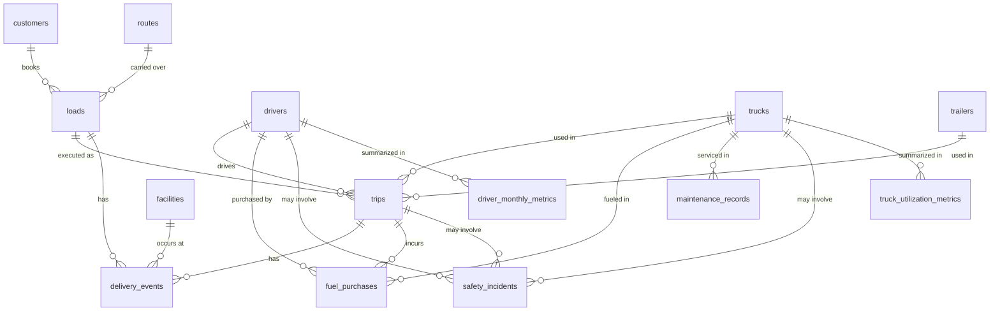

# Data Catalog: Table Relationships

This schema models a trucking/logistics operation: customers book loads, loads move over routes, trips execute those loads using a driver/truck/trailer combination, and a handful of tables capture what happened along the way (delivery events, fuel purchases, maintenance, safety incidents) plus monthly rollups and operational monitoring.

**Note:** the DDL doesn't declare any `FOREIGN KEY` constraints (the only declared constraints are `PRIMARY KEY`s on the three monitoring/audit tables). Every relationship below is inferred from matching `*_id` column names across tables, not from the database itself — worth keeping in mind if you're relying on this for referential integrity rather than just understanding the data model.

## Core entity tables

These hold one row per real-world thing and are referenced by everything else. None of them reference another table.

| Table | Identifier |
|---|---|
| `customers` | `customer_id` |
| `drivers` | `driver_id` |
| `trucks` | `truck_id` |
| `trailers` | `trailer_id` |
| `routes` | `route_id` |
| `facilities` | `facility_id` |

## Operational tables

These capture transactions/events and link back to the core entities above.

| Table | Links to | Via |
|---|---|---|
| `loads` | `customers`, `routes` | `customer_id`, `route_id` |
| `trips` | `loads`, `drivers`, `trucks`, `trailers` | `load_id`, `driver_id`, `truck_id`, `trailer_id` |
| `delivery_events` | `loads`, `trips`, `facilities` | `load_id`, `trip_id`, `facility_id` |
| `fuel_purchases` | `trips`, `trucks`, `drivers` | `trip_id`, `truck_id`, `driver_id` |
| `maintenance_records` | `trucks` | `truck_id` |
| `safety_incidents` | `trips`, `trucks`, `drivers` | `trip_id`, `truck_id`, `driver_id` |

So the central chain is: **customer → load → trip → (driver + truck + trailer)**, with `delivery_events`, `fuel_purchases`, `maintenance_records`, and `safety_incidents` all hanging off whichever piece of that chain they actually happened to (a trip, a truck, a driver, a facility).

## Rollup / metrics tables

One row per entity per month, summarizing the operational tables above.

| Table | Links to | Via |
|---|---|---|
| `driver_monthly_metrics` | `drivers` | `driver_id` (+ `month`) |
| `truck_utilization_metrics` | `trucks` | `truck_id` (+ `month`) |

## Monitoring / governance tables

These don't fit into the operational chain — they reference *other tables generically* rather than pointing at one specific table, so there's no fixed FK column to point at.

| Table | How it references other data |
|---|---|
| `kpi_thresholds` | Standalone config table: defines `warning_threshold` / `critical_threshold` per `kpi_name`. Not linked by ID to anything else — `operational_alerts.kpi_name` matches against it by name, not by a declared key. |
| `operational_alerts` | Polymorphic: `entity_type` + `entity_id` can point at a row in *any* table (e.g. `entity_type = 'driver'`, `entity_id = <driver_id>`), depending on what triggered the alert. |
| `financial_validation_log` | Polymorphic audit log: `table_name` + `record_id` identify which row in which table failed a financial validation check. |

## Relationships at a glance

| From table | From column | To table | To column |
|---|---|---|---|
| loads | customer_id | customers | customer_id |
| loads | route_id | routes | route_id |
| trips | load_id | loads | load_id |
| trips | driver_id | drivers | driver_id |
| trips | truck_id | trucks | truck_id |
| trips | trailer_id | trailers | trailer_id |
| delivery_events | load_id | loads | load_id |
| delivery_events | trip_id | trips | trip_id |
| delivery_events | facility_id | facilities | facility_id |
| fuel_purchases | trip_id | trips | trip_id |
| fuel_purchases | truck_id | trucks | truck_id |
| fuel_purchases | driver_id | drivers | driver_id |
| maintenance_records | truck_id | trucks | truck_id |
| safety_incidents | trip_id | trips | trip_id |
| safety_incidents | truck_id | trucks | truck_id |
| safety_incidents | driver_id | drivers | driver_id |
| driver_monthly_metrics | driver_id | drivers | driver_id |
| truck_utilization_metrics | truck_id | trucks | truck_id |
| operational_alerts | entity_id (polymorphic) | varies by entity_type | — |
| operational_alerts | kpi_name (name match, not a key) | kpi_thresholds | kpi_name |
| financial_validation_log | record_id (polymorphic) | varies by table_name | — |

## Diagram

