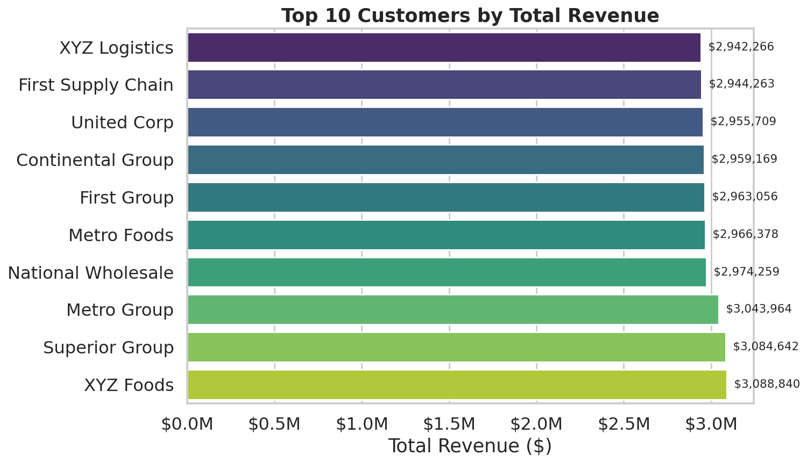
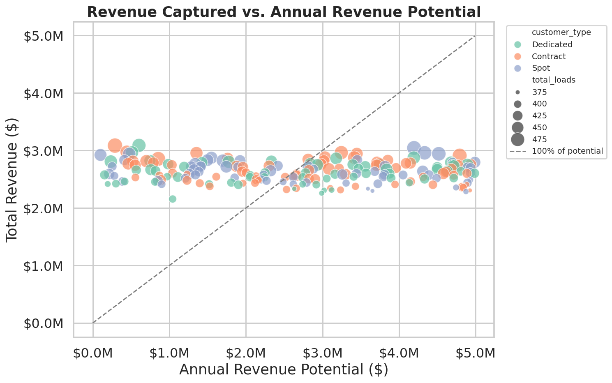
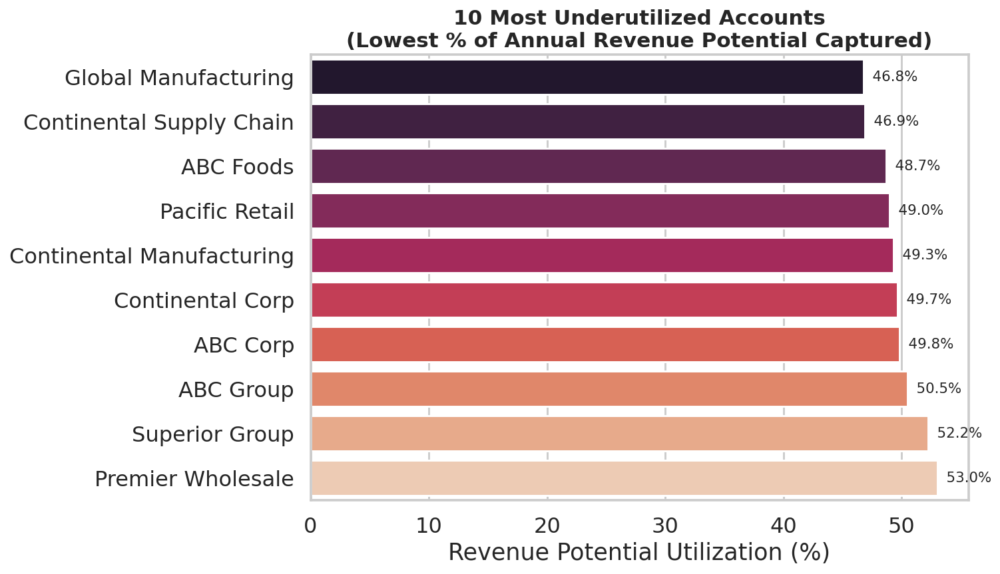
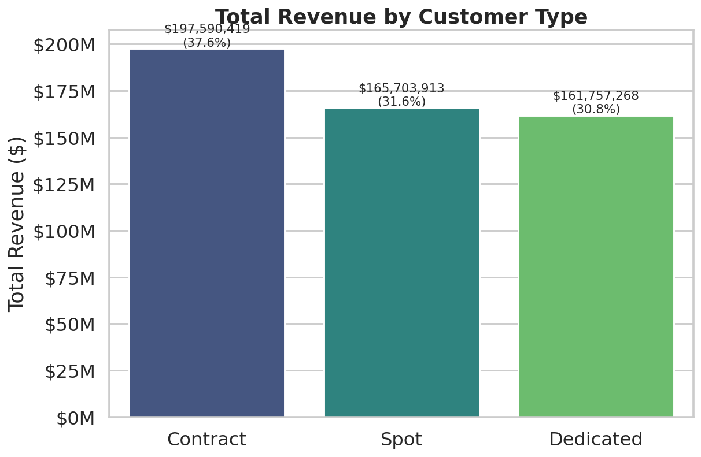
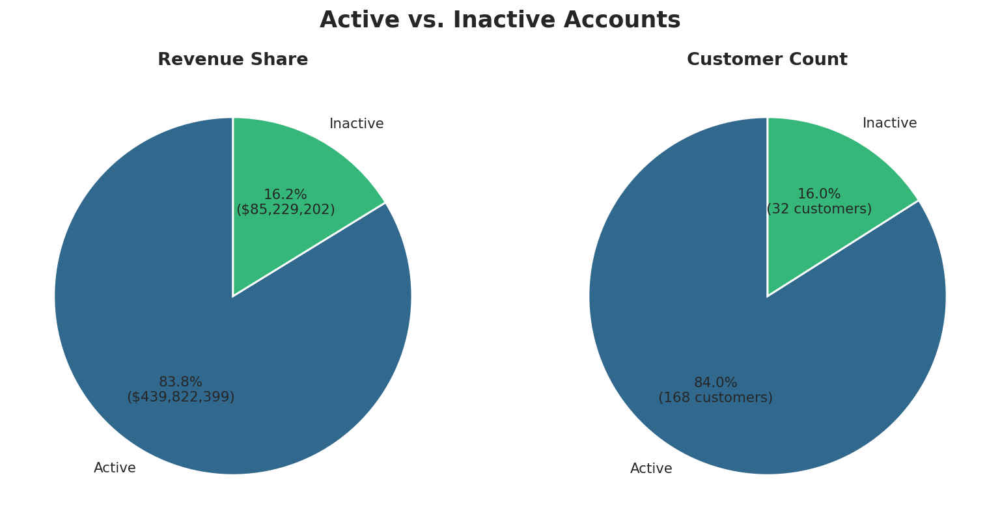
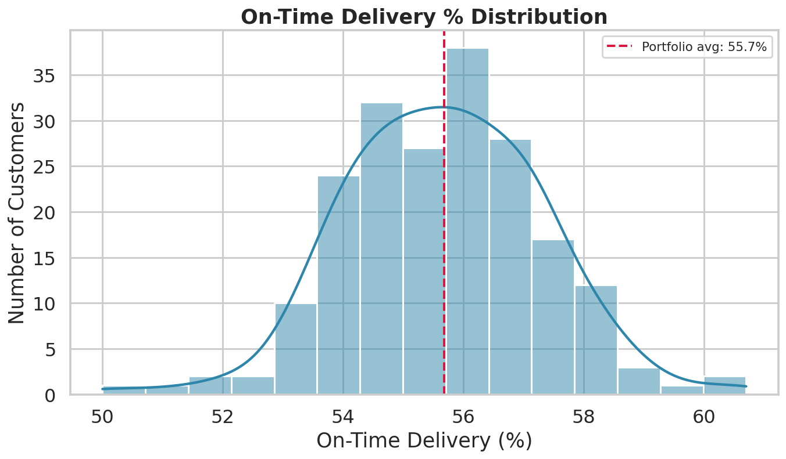

# Customer Performance Report

*Generated from `fn_customers_report()` — full customer base, all-time, no filters applied.*

## Executive Summary

| Metric | Value |
|---|---|
| Total Customers Analyzed | 200 |
| Active Customers | 168 (84.0%) |
| Inactive Customers | 32 (16.0%) |
| Total Portfolio Revenue | $525,051,600.58 |
| Total Annual Revenue Potential | $537,647,349.00 |
| Total Loads Hauled | 85,410 |
| Total Weight Moved | 4,693,705,748 lbs |
| Average Revenue / Load | $6,147.43 |
| Average On-Time Delivery Rate | 55.68% |

This report covers the full customer base (200 accounts) with no date, type, or status filtering — i.e. the all-time view returned by `fn_customers_report()` with default parameters. Revenue is split almost evenly across **Contract**, **Spot**, and **Dedicated** customer types, and on-time delivery performance sits well below typical industry targets (routinely 90%+), suggesting a portfolio-wide service issue rather than a problem isolated to a handful of accounts.

---

## 1. Revenue Analysis

### 1.1 Top 10 Customers by Revenue

| customer_name      | customer_type   | account_status   | total_revenue   |
|:-------------------|:----------------|:-----------------|:----------------|
| XYZ Foods          | Dedicated       | Inactive         | $3,088,840      |
| Superior Group     | Contract        | Active           | $3,084,642      |
| Metro Group        | Spot            | Inactive         | $3,043,964      |
| National Wholesale | Contract        | Active           | $2,974,259      |
| Metro Foods        | Dedicated       | Active           | $2,966,378      |
| First Group        | Contract        | Active           | $2,963,056      |
| Continental Group  | Spot            | Active           | $2,959,169      |
| United Corp        | Contract        | Active           | $2,955,709      |
| First Supply Chain | Contract        | Active           | $2,944,263      |
| XYZ Logistics      | Spot            | Active           | $2,942,266      |

Revenue is heavily concentrated at the top: the top 10 accounts alone represent **$29,922,544**, or **5.7%** of total portfolio revenue. These accounts warrant the closest relationship management — losing even one materially dents overall revenue.

### 1.2 Revenue Captured vs. Annual Revenue Potential

The dashed line marks 100% of stated annual potential. Nearly every account sits **above** that line — actual revenue captured routinely exceeds the `annual_revenue_potential` figure on file, in some cases by 10–25x. This is a useful signal, but it likely means the `annual_revenue_potential` field is a stale or conservative baseline (e.g. set at contract signing and never refreshed) rather than a true ceiling. **Recommendation:** revisit how/when `annual_revenue_potential` is set in the `customers` table — as-is, the `revenue_potential_utilization_pct` metric is hard to use for genuine whitespace analysis.

### 1.3 Revenue Potential Utilization — Outliers

Bottom 10 accounts by utilization (closest to their stated potential, and the most "normal" relative to the rest of the book):

| customer_name             | annual_revenue_potential   | total_revenue   | revenue_potential_utilization_pct   |
|:--------------------------|:---------------------------|:----------------|:------------------------------------|
| Global Manufacturing      | $4,925,587                 | $2,305,539      | 46.8%                               |
| Continental Supply Chain  | $4,873,662                 | $2,285,691      | 46.9%                               |
| ABC Foods                 | $4,838,832                 | $2,357,222      | 48.7%                               |
| Pacific Retail            | $4,824,000                 | $2,362,681      | 49.0%                               |
| Continental Manufacturing | $4,885,593                 | $2,409,726      | 49.3%                               |
| Continental Corp          | $4,744,463                 | $2,356,849      | 49.7%                               |
| ABC Corp                  | $4,893,591                 | $2,437,051      | 49.8%                               |
| ABC Group                 | $4,931,991                 | $2,489,927      | 50.5%                               |
| Superior Group            | $4,983,476                 | $2,603,522      | 52.2%                               |
| Premier Wholesale         | $4,933,788                 | $2,615,241      | 53.0%                               |

Top 5 accounts by utilization (furthest **above** stated potential):

| customer_name            | annual_revenue_potential   | total_revenue   | revenue_potential_utilization_pct   |
|:-------------------------|:---------------------------|:----------------|:------------------------------------|
| United Distribution      | $101,641                   | $2,922,428      | 2875.2%                             |
| American Corp            | $155,103                   | $2,575,852      | 1660.7%                             |
| Elite Group              | $195,918                   | $2,417,560      | 1234.0%                             |
| ABC Wholesale            | $215,203                   | $2,591,150      | 1204.0%                             |
| Continental Supply Chain | $236,754                   | $2,807,899      | 1186.0%                             |

---

## 2. Customer Segmentation

### 2.1 Revenue by Customer Type

| Customer Type | Total Revenue | Avg Revenue / Customer | # Customers |
|---|---|---|---|
| Contract | $197,590,419 | $2,634,539 | 75 |
| Spot | $165,703,913 | $2,630,221 | 63 |
| Dedicated | $161,757,268 | $2,608,988 | 62 |

Revenue is balanced across all three customer types — no single type dominates the book, which is a healthy sign for resilience against freight-market swings (Spot exposure is offset by Contract/Dedicated stability).

### 2.2 Active vs. Inactive Accounts

**168** of **200** customers (84.0%) are currently Active, generating **$439,822,404** (83.8% of total revenue). The **32** Inactive accounts still carry **$85,229,197** in historical revenue — worth a pass to see if any are reasonable win-back candidates given the size of that number.

---

## 3. Delivery Performance

On-time delivery performance clusters tightly between roughly 50% and 61% across the *entire* customer base — there is no group of accounts performing well and another performing poorly. That tight, low band points to a **systemic operational issue** (routing, driver scheduling, facility dwell times, etc.) rather than account-specific service failures.

**Lowest on-time delivery:**

| customer_name            | customer_type   |   total_loads | on_time_delivery_pct   |
|:-------------------------|:----------------|--------------:|:-----------------------|
| Superior Retail          | Dedicated       |           400 | 50.00%                 |
| First Logistics          | Dedicated       |           441 | 51.02%                 |
| Global Group             | Spot            |           421 | 51.90%                 |
| Continental Supply Chain | Dedicated       |           411 | 52.07%                 |
| Metro Distribution       | Dedicated       |           403 | 52.48%                 |

**Highest on-time delivery:**

| customer_name       | customer_type   |   total_loads | on_time_delivery_pct   |
|:--------------------|:----------------|--------------:|:-----------------------|
| United Group        | Spot            |           374 | 60.70%                 |
| ABC Corp            | Spot            |           411 | 60.22%                 |
| First Manufacturing | Spot            |           432 | 59.38%                 |
| Metro Corp          | Contract        |           428 | 59.00%                 |
| Metro Corp          | Contract        |           393 | 58.91%                 |

Even the *best*-performing accounts are only hitting ~60% on-time — there's no internal benchmark of "what good looks like" within this dataset to copy from. Root-cause analysis should look at carrier/driver assignment, lane congestion, and facility-level dwell times rather than customer-specific factors.

---

## 4. Key Findings & Recommendations

1. **Revenue concentration risk** — the top 10 customers drive 5.7% of revenue. Build a formal account-health monitoring cadence for this group.
2. **`annual_revenue_potential` needs revisiting** — virtually every account exceeds its stated potential, often by a wide margin. The field is likely stale and should be recalculated (e.g. trailing-12-months revenue × growth assumption) before using `revenue_potential_utilization_pct` for whitespace/upsell targeting.
3. **On-time delivery is a portfolio-wide problem, not a customer-segment problem** — every customer type and every account sits in the same ~50–61% band. Fixing this requires an operations-side investigation (capacity, routing, dwell time), not account-by-account intervention.
4. **32 Inactive accounts represent $85,229,197 in historical revenue** — worth a quick pass to flag any high-value win-back candidates before writing them off.

---

*Report generated via automated analysis of `fn_customers_report()` output (`fn_customer_report.csv`, 200 rows). Charts built with Python (pandas, matplotlib, seaborn).*