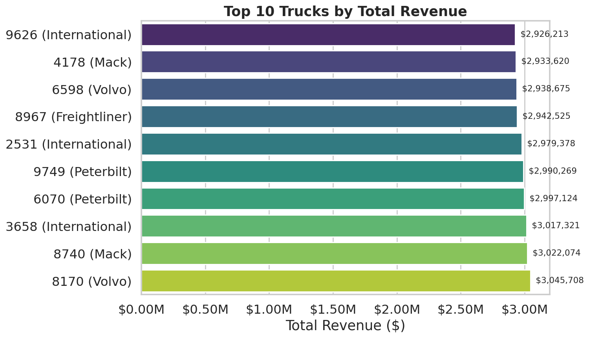
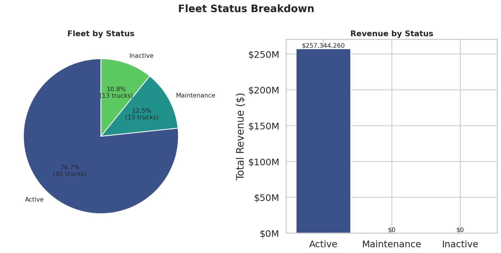
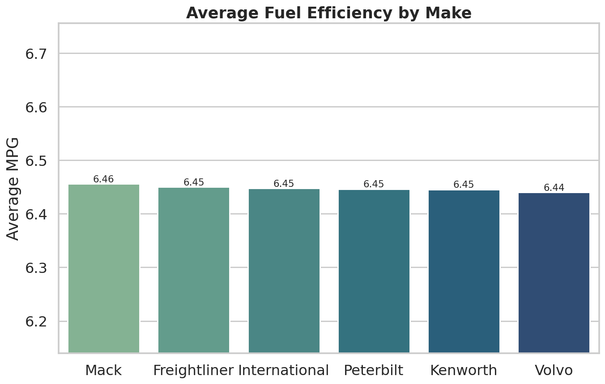
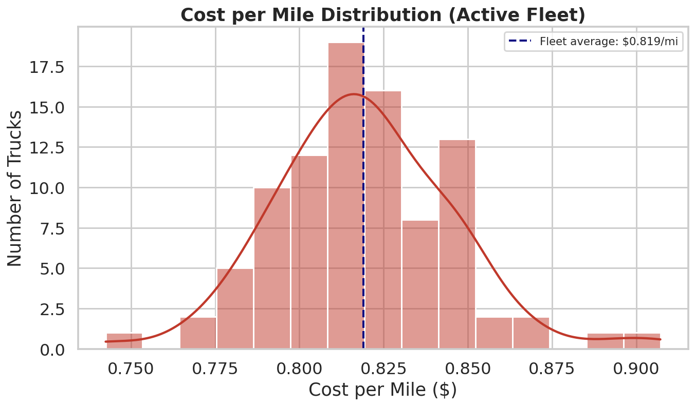
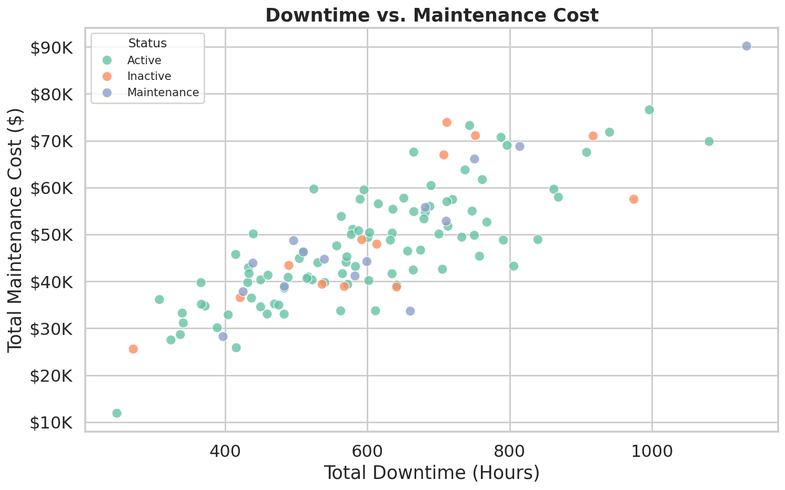
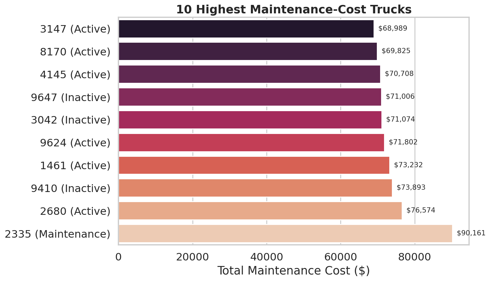

# Truck Fleet Performance Report

*Generated from `fn_trucks_report()` — full fleet, all-time, no filters applied.*

## Executive Summary

| Metric | Value |
|---|---|
| Total Trucks in Fleet | 120 |
| Active | 92 (76.7%) |
| In Maintenance | 15 (12.5%) |
| Inactive | 13 (10.8%) |
| Total Revenue (active fleet) | $257,344,259.90 |
| Total Miles Driven | 119,736,186 |
| Total Trips | 83,738 |
| Average Fuel Efficiency | 6.45 MPG |
| Average Revenue per Mile | $2.15 |
| Average Cost per Mile (fuel + maintenance) | $0.82 |
| Total Maintenance Cost (whole fleet) | $5,730,573.28 |
| Total Downtime (whole fleet) | 72,230.5 hours |

Almost a quarter of the fleet — 28 of 120 trucks — is currently sitting in Maintenance or Inactive status and contributing zero revenue. The 92 active trucks are doing all the work, and they're a pretty uniform group: fuel efficiency and cost per mile barely vary between them. Where the real differences show up is in maintenance burden, which is heavily concentrated in a small number of trucks rather than spread evenly across the fleet.

---

## 1. Revenue Performance

### 1.1 Top 10 Trucks by Revenue

| Unit # | Make | Model Year | Home Terminal | Total Miles | Total Revenue | Avg MPG | Cost per Mile |
|---:|:---|---:|:---|---:|:---|---:|:---|
| 8170 | Volvo | 2015 | Los Angeles | 1,403,922 | $3,045,708 | 6.45 | $0.846 |
| 8740 | Mack | 2017 | Portland | 1,389,705 | $3,022,074 | 6.44 | $0.743 |
| 3658 | International | 2015 | Denver | 1,404,001 | $3,017,321 | 6.46 | $0.797 |
| 6070 | Peterbilt | 2017 | Atlanta | 1,417,530 | $2,997,124 | 6.41 | $0.796 |
| 9749 | Peterbilt | 2015 | Las Vegas | 1,378,108 | $2,990,269 | 6.42 | $0.815 |
| 2531 | International | 2015 | Memphis | 1,386,604 | $2,979,378 | 6.44 | $0.792 |
| 8967 | Freightliner | 2018 | Dallas | 1,370,297 | $2,942,525 | 6.44 | $0.833 |
| 6598 | Volvo | 2015 | Dallas | 1,362,333 | $2,938,675 | 6.45 | $0.822 |
| 4178 | Mack | 2015 | Denver | 1,377,066 | $2,933,620 | 6.51 | $0.819 |
| 9626 | International | 2015 | Denver | 1,343,802 | $2,926,213 | 6.44 | $0.842 |

Unlike a typical revenue report, there's no single truck (or make) running away with the lion's share — the top 10 trucks are all clustered within about $120K of each other. Revenue here tracks almost one-for-one with miles driven, which makes sense for a per-load freight model: the trucks earning the most are simply the ones logging the most miles, not ones charging a premium rate.

### 1.2 Fleet Status Breakdown

The 28 trucks that are down (Maintenance or Inactive) generated **$0** in trip revenue, by definition — but they're not free to keep around. Together they still carry **$1,401,167.85** in maintenance spend and **17,418.3 hours** of downtime on the books, which is capital and shop time spent on equipment that isn't earning. Worth a periodic review of whether the Inactive trucks are worth reactivating or should be sold off.

---

## 2. Fuel Efficiency by Make

| Make | Trucks | Avg MPG | Avg Cost per Mile |
|:---|---:|---:|:---|
| Mack | 14 | 6.46 | $0.814 |
| Freightliner | 15 | 6.45 | $0.818 |
| International | 17 | 6.45 | $0.830 |
| Peterbilt | 16 | 6.45 | $0.821 |
| Kenworth | 11 | 6.45 | $0.819 |
| Volvo | 19 | 6.44 | $0.813 |

The spread across makes is small — well under a tenth of a mile per gallon between the best and worst — so fuel efficiency isn't really a "which brand should we buy more of" question for this fleet. International runs the highest average cost per mile of the group, but it's a modest gap, not a standout problem.

---

## 3. Cost & Maintenance

### 3.1 Cost per Mile Distribution

Cost per mile across the active fleet ranges from $0.7425 (unit 8740, a Mack) up to $0.9071 (unit 9624, an International), with most trucks sitting close to the $0.82 average. That's a fairly tight band — there isn't a cluster of badly underperforming trucks dragging the average down, just a normal spread.

### 3.2 Downtime vs. Maintenance Cost

This is the clearest relationship in the dataset: downtime hours and maintenance cost move together almost in lockstep, regardless of whether a truck is Active, in Maintenance, or Inactive. That's a reassuring sign for data quality — the maintenance figures behave the way you'd expect — and it also means downtime hours alone are a decent early-warning proxy for which trucks are about to become expensive.

### 3.3 Highest Maintenance-Cost Trucks

| Unit # | Make | Status | Maintenance Events | Downtime (Hours) | Total Maintenance Cost |
|---:|:---|:---|---:|---:|:---|
| 2335 | Peterbilt | Maintenance | 41 | 1,133.1 | $90,161 |
| 2680 | Mack | Active | 39 | 996.3 | $76,574 |
| 9410 | Freightliner | Inactive | 32 | 711.7 | $73,893 |
| 1461 | Freightliner | Active | 34 | 743.7 | $73,232 |
| 9624 | International | Active | 34 | 940.4 | $71,802 |
| 3042 | Mack | Inactive | 30 | 751.9 | $71,074 |
| 9647 | Freightliner | Inactive | 35 | 917.3 | $71,006 |
| 4145 | International | Active | 32 | 787.9 | $70,708 |
| 8170 | Volvo | Active | 38 | 1,080.4 | $69,825 |
| 3147 | International | Active | 31 | 796.4 | $68,989 |

Two things stand out here. First, unit 2335 is the single biggest money pit in the fleet by a clear margin — almost $14K above the next-highest truck. Second, unit 9624 shows up on both this list and the cost-per-mile list above as the most expensive truck to run per mile, which lines up: high maintenance cost on a truck logging fewer miles than the top performers pushes its per-mile cost up. That's the one truck worth the closest look for a repair-vs-replace decision.

---

## 4. Key Findings & Recommendations

1. **23% of the fleet is idle and still costing money.** 28 trucks in Maintenance or Inactive status generated zero revenue but carry $1.4M in maintenance spend and over 17K downtime hours between them. Worth a quarterly review of whether the Inactive group should be reactivated, sold, or retired.
2. **Maintenance cost is concentrated, not evenly spread.** A handful of trucks — led by unit 2335 — account for a disproportionate share of fleet maintenance spend. These are the highest-value candidates for a repair-vs-replace analysis rather than spreading attention evenly across all 120 trucks.
3. **Fuel efficiency and cost-per-mile are tightly clustered across makes.** There's no clear "this brand is a bad investment" signal in this fleet — differences between makes are marginal. Purchasing decisions probably shouldn't be driven by brand-level fuel economy here.
4. **Downtime hours predict maintenance cost almost linearly.** Since the two track so closely, downtime alone can be used as an early flag for trucks heading toward a costly maintenance event, without waiting for the invoice to land.
5. **Unit 9624 is the truck to watch.** It's both the highest cost-per-mile truck in the active fleet and a top-10 maintenance spender — the combination worth investigating first.

---

*Report generated via automated analysis of `fn_trucks_report()` output (`trucks_result.csv`, 120 rows). Charts built with Python (pandas, matplotlib, seaborn).*